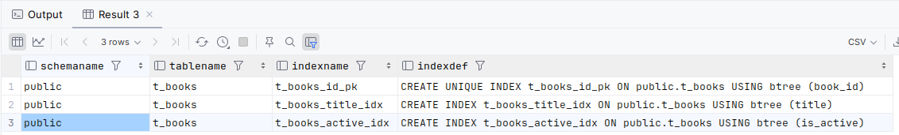
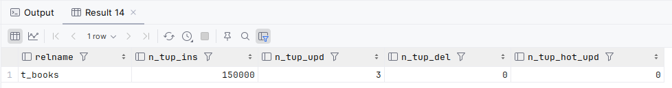
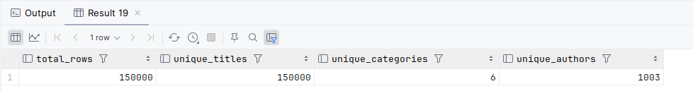

# Задание 1. B-tree индексы в PostgreSQL

> Автор: Дадыков Артемий, БПИ225.

1. Запустите БД через docker compose в ./src/docker-compose.yml:

2. Выполните запрос для поиска книги с названием 'Oracle Core' и получите план выполнения:
   ```sql
   EXPLAIN ANALYZE
   SELECT * FROM t_books WHERE title = 'Oracle Core';
   ```

   *План выполнения:*
   ```text
   Seq Scan on t_books  (cost=0.00..3100.00 rows=1 width=33) (actual time=15.322..15.324 rows=1 loops=1)
     Filter: ((title)::text = 'Oracle Core'::text)
     Rows Removed by Filter: 149999
   Planning Time: 0.194 ms
   Execution Time: 15.340 ms
   ```

   *Объясните результат:*
   Этот план выполнения демонстрирует использование полного сканирования таблицы (Seq Scan), что является неэффективным
   для таких запросов. Чтобы улучшить производительность, можно создать индекс на поле title.


3. Создайте B-tree индексы:
   ```sql
   CREATE INDEX t_books_title_idx ON t_books(title);
   CREATE INDEX t_books_active_idx ON t_books(is_active);
   ```

   *Результат:*
    ```
    workshop.public> CREATE INDEX t_books_title_idx ON t_books(title)
    [2024-11-26 01:55:20] completed in 355 ms
    workshop.public> CREATE INDEX t_books_active_idx ON t_books(is_active)
    [2024-11-26 01:55:20] completed in 57 ms
    ```

4. Проверьте информацию о созданных индексах:
   ```sql
   SELECT schemaname, tablename, indexname, indexdef
   FROM pg_catalog.pg_indexes
   WHERE tablename = 't_books';
   ```

   *Результат:*

   

   *Объясните результат:*
   Создались индексы

5. Обновите статистику таблицы:
   ```sql
   ANALYZE t_books;
   ```

   ```sql
    SELECT 
    relname, 
    n_tup_ins, 
    n_tup_upd, 
    n_tup_del, 
    n_tup_hot_upd 
    FROM pg_stat_user_tables
    WHERE relname = 't_books';
   ```

   *Результат:*
   

6. Выполните запрос для поиска книги 'Oracle Core' и получите план выполнения:
   ```sql
   EXPLAIN ANALYZE
   SELECT * FROM t_books WHERE title = 'Oracle Core';
   ```

   *План выполнения:*
    ```text
    Index Scan using t_books_title_idx on t_books  (cost=0.42..8.44 rows=1 width=33) (actual time=0.074..0.076 rows=1 loops=1)
      Index Cond: ((title)::text = 'Oracle Core'::text)
    Planning Time: 0.337 ms
    Execution Time: 0.100 ms
    ```
   *Объясните результат:*
   После создания индекса на колонке title PostgreSQL использовует Index Scan, что значительно ускоряет выполнение
   запроса по сравнению с полным сканированием таблицы.

7. Выполните запрос для поиска книги по book_id и получите план выполнения:
   ```sql
   EXPLAIN ANALYZE
   SELECT * FROM t_books WHERE book_id = 18;
   ```

   *План выполнения:*
   ```text
   Index Scan using t_books_id_pk on t_books  (cost=0.42..8.44 rows=1 width=33) (actual time=0.053..0.054 rows=1 loops=1)
     Index Cond: (book_id = 18)
   Planning Time: 0.059 ms
   Execution Time: 0.063 ms
   ```

   *Объясните результат:*
   План выполнения должен использует Index Scan, так как индекс на book_id был создан автоматически, когда
   создавался первичный ключ.

8. Выполните запрос для поиска активных книг и получите план выполнения:
   ```sql
   EXPLAIN ANALYZE
   SELECT * FROM t_books WHERE is_active = true;
   ```

   *План выполнения:*
   ```text
   Seq Scan on t_books  (cost=0.00..2725.00 rows=74490 width=33) (actual time=0.005..10.912 rows=74770 loops=1)
     Filter: is_active
     Rows Removed by Filter: 75230
   Planning Time: 0.055 ms
   Execution Time: 12.501 ms
   ```

   *Объясните результат:*
   Использовался Seq Scan, так как поля с маленьким количеством уникальных элементов (boolean) не
   индексируются. [подробнее](https://stackoverflow.com/questions/42972726/postgresql-create-index-for-boolean-column)

9. Посчитайте количество строк и уникальных значений:
   ```sql
   SELECT 
       COUNT(*) as total_rows,
       COUNT(DISTINCT title) as unique_titles,
       COUNT(DISTINCT category) as unique_categories,
       COUNT(DISTINCT author) as unique_authors
   FROM t_books;
   ```

   *Результат:*
   

10. Удалите созданные индексы:
    ```sql
    DROP INDEX t_books_title_idx;
    DROP INDEX t_books_active_idx;
    ```

    *Результат:*
    ```text
    workshop.public> DROP INDEX t_books_title_idx
    [2024-11-26 03:25:48] completed in 4 ms
    workshop.public> DROP INDEX t_books_active_idx
    [2024-11-26 03:25:48] completed in 2 ms
    ```

11. Основываясь на предыдущих результатах, создайте индексы для оптимизации следующих запросов:
    a. `WHERE title = $1 AND category = $2`
    b. `WHERE title = $1`
    c. `WHERE category = $1 AND author = $2`
    d. `WHERE author = $1 AND book_id = $2`

    *Созданные индексы:*
    ```sql
    CREATE INDEX idx_title_category ON t_books(title, category);
    CREATE INDEX idx_title ON t_books(title);
    CREATE INDEX idx_category_author ON t_books(category, author);
    CREATE INDEX idx_author_book_id ON t_books(author, book_id);
    ```

    *Объясните ваше решение:*
    Создаем составные индексы, чтобы ускорить выполнение запросов, которые используют несколько колонок одновременно.
    Это особенно полезно для комбинированных условий WHERE.

12. Протестируйте созданные индексы.

    *Результаты тестов:*
    ```
    Index Scan using idx_author_book_id on t_books  (cost=0.42..8.44 rows=1 width=33) (actual time=0.097..0.099 rows=1 loops=1)
      Index Cond: (((author)::text = 'Jonathan Lewis'::text) AND (book_id = 3001))
    Planning Time: 0.170 ms
    Execution Time: 0.125 ms
    ```

    *Объясните результаты:*
    После создания индексов для комбинированных условий, PostgreSQL выбирает оптимальные индексы для ускорения
    выполнения запросов. Везде Index Scan.


13. Выполните регистронезависимый поиск по началу названия:
    ```sql
    EXPLAIN ANALYZE
    SELECT * FROM t_books WHERE title ILIKE 'Relational%';
    ```

    *План выполнения:*
    ```text
    Seq Scan on t_books  (cost=0.00..3100.00 rows=15 width=33) (actual time=84.860..84.860 rows=0 loops=1)
      Filter: ((title)::text ~~* 'Relational%'::text)
      Rows Removed by Filter: 150000
    Planning Time: 0.946 ms
    Execution Time: 84.885 ms
    ```

    *Объясните результат:*
    План выполнения может включать Seq Scan, поскольку индексы на ILIKE обычно не поддерживаются.

14. Создайте функциональный индекс:
    ```sql
    CREATE INDEX t_books_up_title_idx ON t_books(UPPER(title));
    ```

    *Результат:*
    ```text
    workshop.public> CREATE INDEX t_books_up_title_idx ON t_books(UPPER(title))
    [2024-11-26 03:31:58] completed in 384 ms
    ```

15. Выполните запрос из шага 13 с использованием UPPER:
    ```sql
    EXPLAIN ANALYZE
    SELECT * FROM t_books WHERE UPPER(title) LIKE 'RELATIONAL%';
    ```

    *План выполнения:*
    ```text
    Seq Scan on t_books  (cost=0.00..3475.00 rows=750 width=33) (actual time=86.920..86.920 rows=0 loops=1)
      Filter: (upper((title)::text) ~~ 'RELATIONAL%'::text)
      Rows Removed by Filter: 150000
    Planning Time: 0.157 ms
    Execution Time: 86.947 ms
    ```

    *Объясните результат:*
    Видимо, функциональный индекс не помогает при LIKE.

16. Выполните поиск подстроки:
    ```sql
    EXPLAIN ANALYZE
    SELECT * FROM t_books WHERE title ILIKE '%Core%';
    ```

    *План выполнения:*
    ```text
    Seq Scan on t_books  (cost=0.00..3100.00 rows=15 width=33) (actual time=70.564..70.567 rows=1 loops=1)
      Filter: ((title)::text ~~* '%Core%'::text)
      Rows Removed by Filter: 149999
    Planning Time: 0.113 ms
    Execution Time: 70.580 ms
    ```

    *Объясните результат:*
    Для поиска подстроки с ILIKE в начале и конце строки, PostgreSQL использует Seq Scan, так как
    индексы не поддерживают такие операции.

17. Попробуйте удалить все индексы:
    ```sql
    DO $$ 
    DECLARE
        r RECORD;
    BEGIN
        FOR r IN (SELECT indexname FROM pg_indexes 
                  WHERE tablename = 't_books' 
                  AND indexname != 'books_pkey')
        LOOP
            EXECUTE 'DROP INDEX ' || r.indexname;
        END LOOP;
    END $$;
    ```

    *Объясните результат:*
    Этот блок кода удаляет все индексы, кроме индекса первичного ключа.

18. Создайте индекс для оптимизации суффиксного поиска:
    ```sql
    -- Вариант 1: с reverse()
    CREATE INDEX t_books_rev_title_idx ON t_books(reverse(title));
    
    -- Вариант 2: с триграммами
    CREATE EXTENSION IF NOT EXISTS pg_trgm;
    CREATE INDEX t_books_trgm_idx ON t_books USING gin (title gin_trgm_ops);
    ```

    *Результаты тестов:*
    ```text
    Seq Scan on t_books  (cost=0.00..3475.00 rows=750 width=33) (actual time=48.758..48.758 rows=0 loops=1)
      Filter: (upper((title)::text) ~~ 'RELATIONAL%'::text)
      Rows Removed by Filter: 150000
    Planning Time: 0.134 ms
    Execution Time: 48.780 ms

    Bitmap Heap Scan on t_books  (cost=95.15..150.36 rows=15 width=33) (actual time=0.039..0.040 rows=0 loops=1)
    Recheck Cond: ((title)::text ~~* 'Relational%'::text)
    Rows Removed by Index Recheck: 1
    Heap Blocks: exact=1
    ->  Bitmap Index Scan on t_books_trgm_idx  (cost=0.00..95.15 rows=15 width=0) (actual time=0.029..0.029 rows=1 loops=1)
            Index Cond: ((title)::text ~~* 'Relational%'::text)
    Planning Time: 0.338 ms
    Execution Time: 0.084 ms
    ```

    *Объясните результаты:*
    Вариант с триграммами (pg_trgm) должен улучшает производительность для поиска по подстрокам, а reverse() индекс
    полезен для суффиксного поиска.

19. Выполните поиск по точному совпадению:
    ```sql
    EXPLAIN ANALYZE
    SELECT * FROM t_books WHERE title = 'Oracle Core';
    ```

    *План выполнения:*
    ```text
    Index Scan using idx_title on t_books  (cost=0.42..8.44 rows=1 width=33) (actual time=0.023..0.025 rows=1 loops=1)
    Index Cond: ((title)::text = 'Oracle Core'::text)
    Planning Time: 0.214 ms
    Execution Time: 0.180 ms
    ```

    *Объясните результат:*
    Используется Index Scan, так как запрос ищет точное совпадение с полем, для которого был создан индекс.

20. Выполните поиск по началу названия:
    ```sql
    EXPLAIN ANALYZE
    SELECT * FROM t_books WHERE title ILIKE 'Relational%';
    ```

    *План выполнения:*
    ```text
    Bitmap Heap Scan on t_books  (cost=95.15..150.36 rows=15 width=33) (actual time=0.020..0.020 rows=0 loops=1)
      Recheck Cond: ((title)::text ~~* 'Relational%'::text)
    Rows Removed by Index Recheck: 1
    Heap Blocks: exact=1
    ->  Bitmap Index Scan on t_books_trgm_idx  (cost=0.00..95.15 rows=15 width=0) (actual time=0.014..0.015 rows=1 loops=1)
            Index Cond: ((title)::text ~~* 'Relational%'::text)
    Planning Time: 0.116 ms
    Execution Time: 0.035 ms
    ```

    *Объясните результат:*
    Использование триграммного индекса с оператором ILIKE значительно улучшает производительность поиска по началу
    строки по сравнению с последовательным сканированием таблицы (Seq Scan). Триграммы эффективно обрабатывают строки,
    даже если запрос нечувствителен к регистру.

21. Создайте свой пример индекса с обратной сортировкой:
    ```sql
    CREATE INDEX t_books_desc_idx ON t_books(title DESC);
    ```

    *Тестовый запрос:*
    ```sql
    EXPLAIN ANALYZE
    SELECT * FROM t_books ORDER BY title DESC LIMIT 10;
    ```

    *План выполнения:*
    ```text
    Limit  (cost=0.42..1.02 rows=10 width=33) (actual time=0.016..0.019 rows=10 loops=1)
    ->  Index Scan using t_books_desc_idx on t_books  (cost=0.42..9062.76 rows=150000 width=33) (actual time=0.015..0.017 rows=10 loops=1)
    Planning Time: 0.204 ms
    Execution Time: 0.028 ms
    ```

    *Объясните результат:*
    Индекс с обратной сортировкой полезен для запросов с ORDER BY <column> DESC. Он позволяет PostgreSQL избегать
    операций явной сортировки, снижая время выполнения и стоимость запроса. Такой индекс особенно эффективен в
    комбинации с операциями LIMIT, так как данные извлекаются уже в нужном порядке.
