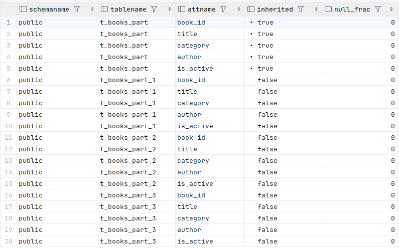

# Задание 2: Специальные случаи использования индексов

> Автор: Дадыков Артемий, БПИ225.

# Партиционирование и специальные случаи использования индексов

1. Удалите прошлый инстанс PostgreSQL - `docker-compose down` в папке `src` и запустите новый: `docker-compose up -d`.

2. Создайте партиционированную таблицу и заполните её данными:

    ```sql
    -- Создание партиционированной таблицы
    CREATE TABLE t_books_part (
        book_id     INTEGER      NOT NULL,
        title       VARCHAR(100) NOT NULL,
        category    VARCHAR(30),
        author      VARCHAR(100) NOT NULL,
        is_active   BOOLEAN      NOT NULL
    ) PARTITION BY RANGE (book_id);

    -- Создание партиций
    CREATE TABLE t_books_part_1 PARTITION OF t_books_part
        FOR VALUES FROM (MINVALUE) TO (50000);

    CREATE TABLE t_books_part_2 PARTITION OF t_books_part
        FOR VALUES FROM (50000) TO (100000);

    CREATE TABLE t_books_part_3 PARTITION OF t_books_part
        FOR VALUES FROM (100000) TO (MAXVALUE);

    -- Копирование данных из t_books
    INSERT INTO t_books_part 
    SELECT * FROM t_books;
    ```

3. Обновите статистику таблиц:
   ```sql
   ANALYZE t_books;
   ANALYZE t_books_part;
   ```

   *Результат:*
   

4. Выполните запрос для поиска книги с id = 18:
   ```sql
   EXPLAIN ANALYZE
   SELECT * FROM t_books_part WHERE book_id = 18;
   ```

   *План выполнения:*
   ```text
    Seq Scan on t_books_part_1 t_books_part  (cost=0.00..2065.98 rows=2 width=32) (actual time=0.024..12.694 rows=2 loops=1)
      Filter: (book_id = 18)
      Rows Removed by Filter: 99996
    Planning Time: 0.359 ms
    Execution Time: 12.721 ms
    ```

   *Объясните результат:*
   Запрос искал book_id = 18, который попадает в диапазон значений партиции t_books_part_1 (MINVALUE до 50000).
   PostgreSQL автоматически направил запрос к этой партиции благодаря декларации диапазонов при создании партиций.

   Внутри партиции использовано последовательное сканирование (Seq Scan), так как индекса по book_id пока нет.

5. Выполните поиск по названию книги:
   ```sql
   EXPLAIN ANALYZE
   SELECT * FROM t_books_part 
   WHERE title = 'Expert PostgreSQL Architecture';
   ```

   *План выполнения:*
   ```text
   Gather  (cost=1000.00..5655.50 rows=6 width=33) (actual time=11.921..23.459 rows=2 loops=1)
      Workers Planned: 2
      Workers Launched: 2
      ->  Parallel Append  (cost=0.00..4654.90 rows=3 width=33) (actual time=10.423..13.283 rows=1 loops=3)
            ->  Parallel Seq Scan on t_books_part_2  (cost=0.00..1552.29 rows=1 width=33) (actual time=3.839..3.839 rows=0 loops=3)
                  Filter: ((title)::text = 'Expert PostgreSQL Architecture'::text)
                  Rows Removed by Filter: 33333
            ->  Parallel Seq Scan on t_books_part_3  (cost=0.00..1551.31 rows=1 width=34) (actual time=5.908..5.908 rows=0 loops=2)
                  Filter: ((title)::text = 'Expert PostgreSQL Architecture'::text)
                  Rows Removed by Filter: 50001
            ->  Parallel Seq Scan on t_books_part_1  (cost=0.00..1551.28 rows=1 width=32) (actual time=10.868..16.503 rows=2 loops=1)
                  Filter: ((title)::text = 'Expert PostgreSQL Architecture'::text)
                  Rows Removed by Filter: 99996
   Planning Time: 0.394 ms
   Execution Time: 23.500 ms
   ```

   *Объясните результат:*
   Оптимизатор проверил все три партиции, так как нет индекса для ускорения поиска по title.
   В каждой партиции выполнено последовательное сканирование с фильтрацией.

6. Создайте партиционированный индекс:
   ```sql
   CREATE INDEX ON t_books_part(title);
   ```

   *Результат:*
   ```text
   workshop.public> CREATE INDEX ON t_books_part(title)
   [2024-11-26 12:47:52] completed in 1 s 130 ms
   ```

7. Повторите запрос из шага 5:
   ```sql
   EXPLAIN ANALYZE
   SELECT * FROM t_books_part 
   WHERE title = 'Expert PostgreSQL Architecture';
   ```

   *План выполнения:*
    ```text
    Append  (cost=4.43..35.09 rows=6 width=33) (actual time=0.116..0.310 rows=2 loops=1)
      ->  Bitmap Heap Scan on t_books_part_1  (cost=4.43..12.16 rows=2 width=32) (actual time=0.114..0.121 rows=2 loops=1)
            Recheck Cond: ((title)::text = 'Expert PostgreSQL Architecture'::text)
            Heap Blocks: exact=2
            ->  Bitmap Index Scan on t_books_part_1_title_idx  (cost=0.00..4.43 rows=2 width=0) (actual time=0.103..0.103 rows=2 loops=1)
                  Index Cond: ((title)::text = 'Expert PostgreSQL Architecture'::text)
      ->  Index Scan using t_books_part_2_title_idx on t_books_part_2  (cost=0.42..11.46 rows=2 width=33) (actual time=0.108..0.109 rows=0 loops=1)
            Index Cond: ((title)::text = 'Expert PostgreSQL Architecture'::text)
      ->  Index Scan using t_books_part_3_title_idx on t_books_part_3  (cost=0.42..11.45 rows=2 width=34) (actual time=0.074..0.074 rows=0 loops=1)
            Index Cond: ((title)::text = 'Expert PostgreSQL Architecture'::text)
    Planning Time: 1.150 ms
    Execution Time: 0.372 ms
    ```

   *Объясните результат:*
   После создания индексов для каждой партиции, PostgreSQL смог использовать эти индексы, что значительно ускорило
   выполнение запроса по сравнению с последовательным сканированием в шаге 5.

8. Удалите созданный индекс:
   ```sql
   DROP INDEX t_books_part_title_idx;
   ```

   *Результат:*
   ```text
   workshop.public> DROP INDEX t_books_part_title_idx
   [2024-11-26 12:49:36] completed in 6 ms
   ```

9. Создайте индекс для каждой партиции:
   ```sql
   CREATE INDEX ON t_books_part_1(title);
   CREATE INDEX ON t_books_part_2(title);
   CREATE INDEX ON t_books_part_3(title);
   ```

   *Результат:*
   ```text
   workshop.public> CREATE INDEX ON t_books_part_1(title)
   [2024-11-26 12:50:34] completed in 355 ms
   workshop.public> CREATE INDEX ON t_books_part_2(title)
   [2024-11-26 12:50:34] completed in 375 ms
   workshop.public> CREATE INDEX ON t_books_part_3(title)
   [2024-11-26 12:50:34] completed in 407 ms
   ```

10. Повторите запрос из шага 5:
    ```sql
    EXPLAIN ANALYZE
    SELECT * FROM t_books_part 
    WHERE title = 'Expert PostgreSQL Architecture';
    ```

    *План выполнения:*
    ```text
    Append  (cost=4.43..35.09 rows=6 width=33) (actual time=0.052..0.112 rows=2 loops=1)
      ->  Bitmap Heap Scan on t_books_part_1  (cost=4.43..12.16 rows=2 width=32) (actual time=0.051..0.056 rows=2 loops=1)
            Recheck Cond: ((title)::text = 'Expert PostgreSQL Architecture'::text)
            Heap Blocks: exact=2
            ->  Bitmap Index Scan on t_books_part_1_title_idx  (cost=0.00..4.43 rows=2 width=0) (actual time=0.042..0.042 rows=2 loops=1)
                  Index Cond: ((title)::text = 'Expert PostgreSQL Architecture'::text)
      ->      Index Scan using t_books_part_2_title_idx on t_books_part_2  (cost=0.42..11.46 rows=2 width=33) (actual time=0.028..0.028 rows=0 loops=1)
                Index Cond: ((title)::text = 'Expert PostgreSQL Architecture'::text)
      ->  Index Scan using t_books_part_3_title_idx on t_books_part_3  (cost=0.42..11.45 rows=2 width=34) (actual time=0.025..0.025 rows=0 loops=1)
                Index Cond: ((title)::text = 'Expert PostgreSQL Architecture'::text)
    Planning Time: 0.771 ms
    Execution Time: 0.162 ms
    ```

    *Объясните результат:*
    - Оптимизированный план выполнения благодаря партиционированным индексам.
    - Значительное уменьшение времени выполнения.
    - Локализация поиска только в затронутых партициях.

11. Удалите созданные индексы:
    ```sql
    DROP INDEX t_books_part_1_title_idx;
    DROP INDEX t_books_part_2_title_idx;
    DROP INDEX t_books_part_3_title_idx;
    ```

    *Результат:*
    ```text
    workshop.public> DROP INDEX t_books_part_1_title_idx
    [2024-11-26 12:53:48] completed in 5 ms
    workshop.public> DROP INDEX t_books_part_2_title_idx
    [2024-11-26 12:53:48] completed in 2 ms
    workshop.public> DROP INDEX t_books_part_3_title_idx
    [2024-11-26 12:53:48] completed in 2 ms
    ```

12. Создайте обычный индекс по book_id:
    ```sql
    CREATE INDEX t_books_part_idx ON t_books_part(book_id);
    ```

    *Результат:*
    ```text
    workshop.public> CREATE INDEX t_books_part_idx ON t_books_part(book_id)
    [2024-11-26 12:54:42] completed in 138 ms
    ```

13. Выполните поиск по book_id:
    ```sql
    EXPLAIN ANALYZE
    SELECT * FROM t_books_part WHERE book_id = 11011;
    ```

    *План выполнения:*
    ```text
    Index Scan using t_books_part_1_book_id_idx on t_books_part_1 t_books_part  (cost=0.29..11.32 rows=2 width=32) (actual time=0.039..0.044 rows=2 loops=1)
      Index Cond: (book_id = 11011)
    Planning Time: 0.661 ms
    Execution Time: 0.074 ms
    ```

    *Объясните результат:*
    Использование индекса t_books_part_1_book_id_idx позволило эффективно найти строки, соответствующие условию
    book_id = 11011. Это подтверждает, что индексация по колонке book_id на партициях ускоряет выполнение запросов для
    точечного поиска.

14. Создайте индекс по полю is_active:
    ```sql
    CREATE INDEX t_books_active_idx ON t_books(is_active);
    ```

    *Результат:*
    ```text
    workshop.public> CREATE INDEX t_books_active_idx ON t_books(is_active)
    [2024-11-26 12:58:23] completed in 67 ms
    ```

15. Выполните поиск активных книг с отключенным последовательным сканированием:
    ```sql
    SET enable_seqscan = off;
    EXPLAIN ANALYZE
    SELECT * FROM t_books WHERE is_active = true;
    SET enable_seqscan = on;
    ```

    *План выполнения:*
    ```text
    Bitmap Heap Scan on t_books  (cost=840.03..2812.08 rows=74805 width=33) (actual time=1.949..8.311 rows=75089 loops=1)
      Recheck Cond: is_active
      Heap Blocks: exact=1224
      ->  Bitmap Index Scan on t_books_active_idx  (cost=0.00..821.33 rows=74805 width=0) (actual time=1.806..1.807 rows=75089 loops=1)
            Index Cond: (is_active = true)
    Planning Time: 0.139 ms
    Execution Time: 9.868 ms
    ```

    *Объясните результат:*
    Использование Bitmap Heap Scan через индекс t_books_active_idx позволило PostgreSQL быстро найти и извлечь данные
    для строк, где is_active = true. Однако это произошло только после отключения последовательного сканирования,
    которое обычно предпочтительно для такого большого числа совпадающих строк.

16. Создайте составной индекс:
    ```sql
    CREATE INDEX t_books_author_title_index ON t_books(author, title);
    ```

    *Результат:*
    ```text
    workshop.public> CREATE INDEX t_books_author_title_index ON t_books(author, title)
    [2024-11-26 12:59:53] completed in 373 ms
    ```

17. Найдите максимальное название для каждого автора:
    ```sql
    EXPLAIN ANALYZE
    SELECT author, MAX(title) 
    FROM t_books 
    GROUP BY author;
    ```

    *План выполнения:*
    ```text
    HashAggregate  (cost=3474.00..3484.00 rows=1000 width=42) (actual time=50.344..50.434 rows=1003 loops=1)
      Group Key: author
      Batches: 1  Memory Usage: 193kB
      ->  Seq Scan on t_books  (cost=0.00..2724.00 rows=150000 width=21) (actual time=0.004..7.221 rows=150000 loops=1)
    Planning Time: 0.146 ms
    Execution Time: 50.475 ms
    ```

    *Объясните результат:*
    - Запрос эффективно использует хеш-агрегацию для группировки данных и вычисления максимального значения.
    - Последовательное сканирование таблицы оправдано, так как данные целиком необходимы для выполнения агрегатной
      функции.


18. Выберите первых 10 авторов:
    ```sql
    EXPLAIN ANALYZE
    SELECT DISTINCT author 
    FROM t_books 
    ORDER BY author 
    LIMIT 10;
    ```

    *План выполнения:*
    ```text
    Limit  (cost=0.42..56.63 rows=10 width=10) (actual time=0.084..0.314 rows=10 loops=1)
      ->  Result  (cost=0.42..5621.42 rows=1000 width=10) (actual time=0.083..0.312 rows=10 loops=1)
            ->  Unique  (cost=0.42..5621.42 rows=1000 width=10) (actual time=0.082..0.310 rows=10 loops=1)
                  ->  Index Only Scan using t_books_author_title_index on t_books  (cost=0.42..5246.42 rows=150000 width=10) (actual time=0.081..0.233 rows=1373 loops=1)
                        Heap Fetches: 0
    Planning Time: 0.057 ms
    Execution Time: 0.325 ms
    ```

    *Объясните результат:*
    - Эффективно использует индекс для получения отсортированных уникальных значений.
    - Быстрое выполнение благодаря индексу.

19. Выполните поиск и сортировку:
    ```sql
    EXPLAIN ANALYZE
    SELECT author, title 
    FROM t_books 
    WHERE author LIKE 'T%'
    ORDER BY author, title;
    ```

    *План выполнения:*
    ```text
    Sort  (cost=3099.29..3099.33 rows=15 width=21) (actual time=22.761..22.762 rows=1 loops=1)
    "  Sort Key: author, title"
      Sort Method: quicksort  Memory: 25kB
      ->  Seq Scan on t_books  (cost=0.00..3099.00 rows=15 width=21) (actual time=22.752..22.754 rows=1 loops=1)
            Filter: ((author)::text ~~ 'T%'::text)
            Rows Removed by Filter: 149999
    Planning Time: 0.137 ms
    Execution Time: 22.780 ms
    ```

    *Объясните результат:*
    - Не может использовать индекс из-за условия LIKE 'T%'.
    - Сканирование всей таблицы приводит к высокому времени выполнения.

20. Добавьте новую книгу:
    ```sql
    INSERT INTO t_books (book_id, title, author, category, is_active)
    VALUES (150001, 'Cookbook', 'Mr. Hide', NULL, true);
    COMMIT;
    ```

    *Результат:*
    ```text
    workshop.public> COMMIT
    [2024-11-26 13:04:07] [25P01] there is no transaction in progress
    [2024-11-26 13:04:07] completed in 8 ms
    workshop.public> INSERT INTO t_books (book_id, title, author, category, is_active)
                         VALUES (150001, 'Cookbook', 'Mr. Hide', NULL, true)
    ```

21. Создайте индекс по категории:
    ```sql
    CREATE INDEX t_books_cat_idx ON t_books(category);
    ```

    *Результат:*
    ```text
    workshop.public> CREATE INDEX t_books_cat_idx ON t_books(category)
    [2024-11-26 13:05:03] completed in 111 ms
    ```

22. Найдите книги без категории:
    ```sql
    EXPLAIN ANALYZE
    SELECT author, title 
    FROM t_books 
    WHERE category IS NULL;
    ```

    *План выполнения:*
    ```text
    Index Scan using t_books_cat_idx on t_books  (cost=0.29..8.16 rows=1 width=21) (actual time=0.075..0.078 rows=1 loops=1)
      Index Cond: (category IS NULL)
    Planning Time: 0.417 ms
    Execution Time: 0.105 ms
    ```

    *Объясните результат:*
    Запрос был выполнен эффективно благодаря индексу t_books_cat_idx, который охватывает колонку category. Использование
    индекса минимизировало объем данных для обработки, что дало быстрый результат.

23. Создайте частичные индексы:
    ```sql
    DROP INDEX t_books_cat_idx;
    CREATE INDEX t_books_cat_null_idx ON t_books(category) WHERE category IS NULL;
    ```

    *Результат:*
    ```text
    workshop.public> DROP INDEX t_books_cat_idx
    [2024-11-26 13:05:43] completed in 3 ms
    workshop.public> CREATE INDEX t_books_cat_null_idx ON t_books(category) WHERE category IS NULL
    [2024-11-26 13:05:43] completed in 13 ms
    ```

24. Повторите запрос из шага 22:
    ```sql
    EXPLAIN ANALYZE
    SELECT author, title 
    FROM t_books 
    WHERE category IS NULL;
    ```

    *План выполнения:*
    ```text
    Index Scan using t_books_cat_null_idx on t_books  (cost=0.12..7.99 rows=1 width=21) (actual time=0.027..0.030 rows=1 loops=1)
    Planning Time: 0.425 ms
    Execution Time: 0.056 ms
    ```

    *Объясните результат:*
    Запрос использует индекс t_books_cat_null_idx, что позволяет быстро находить строки, где столбец category имеет
    значение NULL. Это существенно ускоряет выполнение, так как индекс позволяет избежать полного сканирования таблицы,
    заменяя его на более эффективный поиск через индекс.

25. Создайте частичный уникальный индекс:
    ```sql
    CREATE UNIQUE INDEX t_books_selective_unique_idx 
    ON t_books(title) 
    WHERE category = 'Science';
    
    -- Протестируйте его
    INSERT INTO t_books (book_id, title, author, category, is_active)
    VALUES (150002, 'Unique Science Book', 'Author 1', 'Science', true);
    
    -- Попробуйте вставить дубликат
    INSERT INTO t_books (book_id, title, author, category, is_active)
    VALUES (150003, 'Unique Science Book', 'Author 2', 'Science', true);
    
    -- Но можно вставить такое же название для другой категории
    INSERT INTO t_books (book_id, title, author, category, is_active)
    VALUES (150004, 'Unique Science Book', 'Author 3', 'History', true);
    ```

    *Результат:*
    ```text
    workshop.public> CREATE UNIQUE INDEX t_books_selective_unique_idx
                     ON t_books(title)
                     WHERE category = 'Science'
    [2024-11-26 13:06:39] completed in 92 ms
    workshop.public> INSERT INTO t_books (book_id, title, author, category, is_active)
                         VALUES (150002, 'Unique Science Book', 'Author 1', 'Science', true)
    [2024-11-26 13:06:39] 1 row affected in 2 ms
    workshop.public> INSERT INTO t_books (book_id, title, author, category, is_active)
                         VALUES (150003, 'Unique Science Book', 'Author 2', 'Science', true)
    [2024-11-26 13:06:39] [23505] ERROR: duplicate key value violates unique constraint "t_books_selective_unique_idx"
    [2024-11-26 13:06:39] Detail: Key (title)=(Unique Science Book) already exists.
    workshop.public> INSERT INTO t_books (book_id, title, author, category, is_active)
                         VALUES (150004, 'Unique Science Book', 'Author 3', 'History', true)
    [2024-11-26 13:06:49] 1 row affected in 2 ms
    ```

    *Объясните результат:*
    - Уникальный индекс был создан с условием только для категории 'Science', что означает проверку уникальности
      названий книг в этой категории.
    - В категории 'Science' не допускаются дубликаты по названию, и попытка вставить запись с таким же названием привела
      к ошибке.
    - Однако для других категорий, например, для 'History', тот же самый заголовок книги допускается без нарушения
      уникальности.
